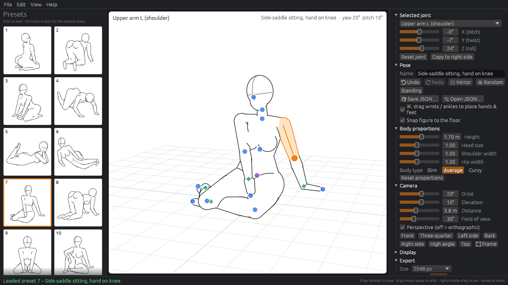
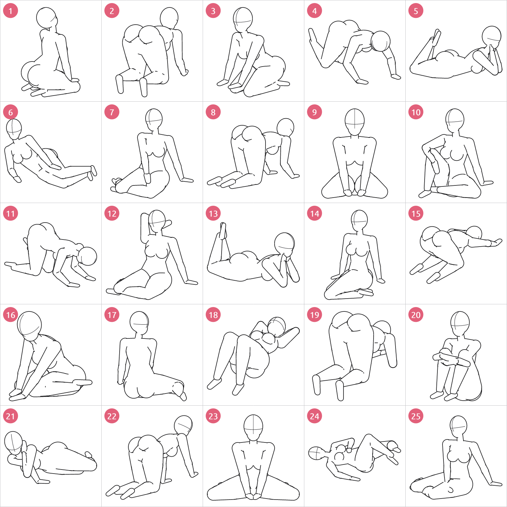
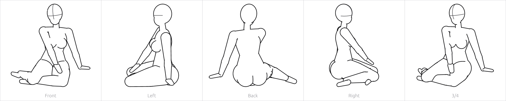

# Rust Pose Studio

A lightweight desktop **drawing mannequin** for figure-drawing practice, written in Rust with
[egui/eframe](https://github.com/emilk/egui). Pick one of 25 built-in floor poses, orbit the
camera to look at it from any angle, adjust the pose by dragging joints (with two-bone IK for
hands and feet), and export clean line-art reference images or a numbered contact sheet.

[繁體中文說明](#繁體中文說明) · [Download (Windows installer / portable exe)](https://github.com/stevenke1981/rust-pose-studio/releases/latest)



## Features

- **3D posable mannequin** – 17-joint skeleton (pelvis root → waist → chest → neck → head,
  shoulders/upper arms/forearms/hands, thighs/shins/feet). Joint rotations are Euler angles
  evaluated with forward kinematics. The female mannequin body (slim waist, broad hips, long
  legs, ~6.5-head proportions, mitten hands, simple feet, egg-shaped head) is built from
  smoothly blended tapered volumes and drawn as **pure line art**: white fill, one clean black
  contour around the union silhouette, and interior lines only where it matters – where a part
  passes in front of another (thigh over calf, arm over torso) and where two body parts meet in
  a fold (hip crease, buttock fold, under the bust, behind a bent knee or elbow). No gray fills,
  no shading, no visible joint balls; the head carries a center line and an eye line that follow
  its orientation. Floor shadows / grid are optional (off by default in exports).
- **Camera** – orbit, pan and zoom; perspective or orthographic projection; front / ¾ /
  side / back / high-angle / top presets; one-click framing.
- **25 built-in floor poses** shown as a live-rendered thumbnail gallery – sitting back on the
  heels, kneeling on all fours, sitting between the heels, crawling, lying on the stomach with
  the chin in the hands, side-lying propped on a forearm, side-saddle sitting, wide and frog
  kneels, child's pose, mermaid sit, hugging the knees, lying on the back and more. Each preset
  stores its own default camera angle (used for the thumbnail, the contact sheet and when it is
  loaded). Every preset is grounded on the floor.
- **Manual posing**
  - click a joint handle or body part to select it;
  - drag blue handles to rotate a joint (FK), drag the green diamonds at wrists and ankles to
    place hands and feet with **two-bone IK** (elbow/knee bend direction is preserved),
    drag the purple pelvis handle to move the whole figure;
  - sliders for the selected joint's X/Y/Z rotation (elbows/knees are hinge joints);
  - reset joint, copy a joint to the other side, mirror the whole pose, random pose,
    standing pose, **undo/redo**, optional automatic snapping to the floor.
- **Body proportions** – height, head size, shoulder width, hip width and body type
  (slim / average / curvy). Proportions never change the joint angles.
- **Save / load poses** as small human-readable JSON files.
- **Export** (rendered by a CPU rasteriser built on `tiny-skia`, so it does not depend on the GPU
  and matches the on-screen style): PNG of the current view at 512–4096 px, white or
  transparent background, optional shadow / grid floor; and a **contact sheet** of all presets
  (or a Ctrl+click selection): 5×5 grid, thin gray cell borders, a pink rounded number badge in
  each cell's corner, optional pose names. Exports run on a background thread.
- **Headless CLI** for scripting/batch export (see below).



Turnaround export (`--turnaround`) of preset 7:



## Controls

| Action | How |
| --- | --- |
| Select a joint | click its handle or the body part |
| Rotate a joint (FK) | drag a blue handle |
| Place hand / foot (IK) | drag the green diamond at the wrist / ankle |
| Move the figure | drag the purple pelvis handle |
| Orbit camera | drag empty space with the left button |
| Pan | right- or middle-drag |
| Zoom | mouse wheel |
| Undo / redo | Ctrl+Z / Ctrl+Y (or Ctrl+Shift+Z) |
| Save / open pose JSON | Ctrl+S / Ctrl+O |
| Export PNG | Ctrl+E |
| Mirror pose / reset joint / frame figure | M / R / F |
| Load preset / pick for contact sheet | click / Ctrl+click a thumbnail |

## Command line

```text
rust-pose-studio                         start the GUI
rust-pose-studio --contact-sheet OUT.png [--cell PX] [--cols N] [--yaw DEG] [--pitch DEG]
                 [--transparent] [--names] [--no-numbers] [--title TEXT] [--only 1,5,9]
rust-pose-studio --render POSE OUT.png   POSE = preset number (1-25) or a pose .json file
                 [--size PX] [--yaw DEG] [--pitch DEG] [--transparent] [--grid | --shadow]
                 [--turnaround]
rust-pose-studio --list                  list the built-in presets
rust-pose-studio --floor-report          show which body parts touch the floor per preset
rust-pose-studio --help | --version
```

## Pose file format

```json
{
  "format": "rust-pose-studio/pose",
  "version": 1,
  "name": "Sitting on heels, arching back",
  "root": [0.0, 0.52, 0.0],
  "joints": { "pelvis": [0, 0, 0], "thigh_l": [-90, 0, 0], "shin_l": [150, 0, 0] },
  "proportions": { "height": 1.7, "head_size": 1.0, "shoulder_width": 1.0, "hip_width": 1.0, "body_type": "average" },
  "camera": { "yaw": 30, "pitch": 12 }
}
```

Angles are degrees (X, Y, Z Euler angles relative to the parent joint, applied as Rz·Ry·Rx),
`root` is the pelvis position in metres (Y up, the figure faces +Z, +X is the figure's left).
Missing joints default to 0°, unknown keys are ignored; `proportions` and `camera` are optional.

## Install

- **Windows**: download `rust-pose-studio-<version>-x64-setup.exe` from
  [Releases](https://github.com/stevenke1981/rust-pose-studio/releases). It installs to
  `C:\Program Files\Rust Pose Studio`, adds Start Menu shortcuts, and (optional, on by
  default) adds the install folder to the system `PATH`. A portable `.exe` is attached too.
- **Linux / macOS**: build from source.

## Build from source

Requires Rust 1.95+ (edition 2024).

```bash
# Debian/Ubuntu build dependencies
sudo apt-get install pkg-config libgtk-3-dev libxcb-render0-dev libxcb-shape0-dev \
  libxcb-xfixes0-dev libxkbcommon-dev libgl1-mesa-dev libwayland-dev

cargo build --release          # target/release/rust-pose-studio
cargo test                     # FK, IK, JSON round-trip, preset validity, PNG export
cargo clippy --all-targets
```

Windows installer (NSIS 3): `cargo build --release --target x86_64-pc-windows-msvc`, then
`makensis /DVERSION=0.2.0 installer\windows\rust-pose-studio.nsi` (writes to `dist\`).
Tagging `v*` builds the installer and the portable exe in GitHub Actions and attaches them to
the release.

## Project layout

| File | Purpose |
| --- | --- |
| `src/math.rs` | small Vec3 / Mat3 / Euler helpers |
| `src/skeleton.rs` | joints, proportions, poses, forward kinematics, mirroring |
| `src/body.rs` | tapered body volumes (round cones / ellipsoids), floor snapping, drag handles |
| `src/ik.rs`, `src/posing.rs` | two-bone IK solver, limb aiming, random poses |
| `src/presets.rs` | the 25 built-in poses (authored with a small pose-builder DSL) |
| `src/lineart.rs` | line-art renderer: tessellation, software z-buffer, contour & crease extraction |
| `src/render.rs` | camera, projection, 2D draw list (fill mask + lines) shared by GUI and export |
| `src/raster.rs`, `src/export.rs` | tiny-skia rasteriser, PNG and contact-sheet export |
| `src/pose_io.rs` | pose JSON |
| `src/cli.rs` | headless command line |
| `src/app/` | the egui application |

## Credits

The built-in poses are original pose data **inspired by common figure-drawing reference pose
types** (kneeling, sitting, lying, crouching, all fours…). No third-party artwork is included or
traced; all images are rendered by this program. UI font: Ubuntu Light (bundled with egui).

## License

[MIT](LICENSE) © 2026 Ke Sheng Da

---

## 繁體中文說明

**Rust Pose Studio** 是一個用 Rust + egui 撰寫的輕量桌面「繪畫用人體模型」工具，
適合人物速寫與姿勢練習：選擇 25 個內建的地面姿勢、從任意角度旋轉觀看、拖曳關節調整姿勢，
並匯出乾淨的線稿參考圖或帶編號的姿勢總表（contact sheet）。

### 功能

- **3D 可動人偶**：17 個關節的骨架（骨盆為根節點 → 腰 → 胸 → 頸 → 頭，肩／上臂／前臂／手、
  大腿／小腿／腳），以尤拉角 + 正向運動學（FK）計算。女性人體模型（細腰、寬臀、長腿、
  約 6.5 頭身、連指手套式的手、簡化的腳、蛋形頭部）由平滑銜接的錐形體積組成，
  並以**純線稿**繪製：白色填色、沿整體輪廓的單一乾淨黑線，只在部位重疊（大腿壓小腿、
  手臂在軀幹前）與身體折線（鼠蹊、臀線、胸部下緣、彎曲的膝窩／肘窩）處畫內部線條；
  沒有灰色填色、沒有明暗、沒有關節球；頭部有隨方向轉動的中心線與眼睛線。
  地面陰影／格線為選用（匯出預設關閉）。
- **攝影機**：環繞、平移、縮放；透視／正交投影；正面、3/4、側面、背面、俯視等預設視角。
- **25 個內建地面姿勢**（縮圖即時渲染）：跪坐後仰、四肢跪地、鴨子坐、爬行、趴著托腮、
  側躺前臂撐地、側坐、大開膝跪坐、青蛙跪、嬰兒式、美人魚坐、抱膝坐、仰躺等。
  每個姿勢都記錄了自己的預設攝影機角度（用於縮圖、總表與載入時），且都確實貼地。
- **手動調整**：點選關節；拖曳藍色控制點旋轉關節（FK）；拖曳手腕／腳踝的綠色菱形以
  **雙骨 IK** 擺放手腳；拖曳紫色骨盆點移動整個人偶；選取關節的 X/Y/Z 旋轉滑桿
  （手肘、膝蓋為鉸鏈關節）；重設關節、複製到另一側、整體左右鏡像、隨機姿勢、
  **復原／重做**、自動貼地。
- **身體比例**：身高、頭部大小、肩寬、臀寬、體型（纖細／標準／豐滿）。
- **姿勢存檔／讀取**：可讀的 JSON 格式。
- **匯出**：使用 CPU 光柵化（tiny-skia），不依賴 GPU，且與畫面風格一致；可匯出目前視角
  的 PNG（512–4096 px、白底或透明背景），以及所有（或以 Ctrl+點選挑選的）姿勢的總表
  （5×5 格、細灰框線、左上角粉紅圓形編號，姿勢名稱可選）。
  匯出在背景執行緒進行，不會卡住介面。
- **命令列模式**：可批次輸出圖片（見上方 Command line）。

### 操作

| 動作 | 方式 |
| --- | --- |
| 選取關節 | 點擊控制點或身體部位 |
| 旋轉關節（FK） | 拖曳藍色控制點 |
| 擺放手／腳（IK） | 拖曳手腕／腳踝的綠色菱形 |
| 移動人偶 | 拖曳紫色骨盆控制點 |
| 環繞視角 | 在空白處以左鍵拖曳 |
| 平移／縮放 | 右鍵或中鍵拖曳／滑鼠滾輪 |
| 復原／重做 | Ctrl+Z ／ Ctrl+Y |
| 儲存／開啟姿勢 | Ctrl+S ／ Ctrl+O |
| 匯出 PNG | Ctrl+E |
| 鏡像／重設關節／對焦人偶 | M ／ R ／ F |

### 安裝

- **Windows**：到 [Releases](https://github.com/stevenke1981/rust-pose-studio/releases) 下載
  `rust-pose-studio-<版本>-x64-setup.exe`，會安裝到 `C:\Program Files\Rust Pose Studio`、
  建立開始功能表捷徑，並（預設勾選）把安裝目錄加入系統 `PATH`；另附免安裝版 exe。
- **Linux / macOS**：請依上方說明自行編譯（`cargo build --release`）。

### 版權

內建姿勢為本專案自行建立的姿勢資料，**靈感來自常見的人物速寫參考姿勢類型**；
專案中不包含、也未描摹任何第三方畫作，所有圖片皆由本程式渲染。
授權：[MIT](LICENSE) © 2026 Ke Sheng Da
